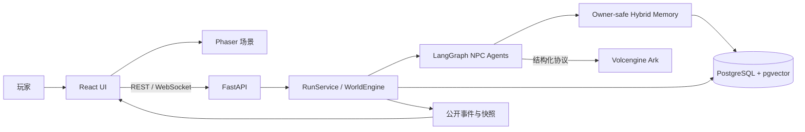

# 🌿 Qinghuai Agent World（青槐老巷）

### 基于 LangGraph、混合记忆与权威世界状态的多智能体互动叙事系统

五名自治 NPC · 七日持续世界 · Owner-safe Memory · React + Phaser 可视化 · 可复现 Agent Eval

[](https://github.com/ll555yy/qinghuai-agent-world/actions/workflows/ci.yml)

_系统主链路：世界事件 → NPC Agent 决策 → 按需记忆召回 → 结构化动作 → 后端规则裁决 → REST / WebSocket 投影_

[快速开始](#-快速开始) · [项目架构](#️-项目架构) · [核心实现](#-核心实现) · [自定义场景](#-自定义场景) · [评测与测试](#-评测与测试) · [已知边界](#-已知边界)


## 💡 项目简介

Qinghuai Agent World 是一个可持续推进的七日互动世界。玩家在旧书店中接触五名拥有不同人格、目标、关系和私有记忆的 NPC，可以旁观他们自主行动，也可以通过邀请和公开对话影响最终方案。

这个项目重点解决的不是“让多个模型轮流说话”，而是 Agent 应用落地时更棘手的四个问题：

- **状态可信**：模型只能提出结构化决策，时间、参与者、立场、Goal 和结局由后端规则统一写入。
- **记忆隔离**：检索始终重新应用 `run_id + owner_npc_id` 边界，避免 NPC 读取他人的私有 Goal 或 Memory。
- **长程运行**：对话分段压缩、离场沉淀、数据库恢复和失败降级共同支撑七日世界推进。
- **结果可验证**：规则评分、LLM Judge、PostgreSQL 留出集、Playwright 全栈链路和预注册模拟分别验证不同层面。

## ✨ 核心特性

| 能力 | 实现 |
|---|---|
| 🧠 多 NPC Agent | LangGraph 为日常行动、邀请、聊天、台词、摘要与离场沉淀建立显式状态图 |
| 🔎 混合记忆 | 关键词、Actor、Goal、Topic、2048 维向量与最多两跳关系图联合召回 |
| 🔐 私有信息边界 | Owner-scoped 查询、公开投影白名单、证据 ID 校验与 Prompt 注入回归用例 |
| ⚖️ 权威世界规则 | FastAPI `RunService` / `WorldEngine` 是世界状态唯一写入口，模型不能直接改结局 |
| 💾 可恢复持久化 | PostgreSQL 17 + pgvector、Alembic 空库迁移、Run 重载与向量幂等回填 |
| 🎮 可玩前端 | React 19 + Phaser 3 场景、Zustand 状态、REST / WebSocket 实时事件 |
| 📊 Agent Eval | 47 Case 语义集、确定性规则、Judge 校准、人工复核边界和脱敏报告 |
| ✅ 工程门禁 | Pytest、Ruff、Mypy、Vitest、Playwright、真实 PostgreSQL 全栈黄金链路 |

## 💻 运行界面

世界画面展示公开时间、角色位置、聊天圈与台词；侧栏负责人物卡片、邀请、会话和玩家输入。前端只消费公开快照，不接触 NPC 私有 Prompt、Goal 或 Memory 正文。


## 🚀 快速开始

> [!IMPORTANT]
> 完整运行需要 Python 3.12、Node.js 22、pnpm 11.22 和 Docker。没有真实模型 Key 也可以完成安装、启动健康检查和运行全部离线测试；真实 NPC 生成与向量能力需要配置火山方舟。

### 步骤 1 · 获取代码并准备环境

```bash
git clone https://github.com/ll555yy/qinghuai-agent-world.git
cd qinghuai-agent-world

python -m venv .venv
# Windows PowerShell: .\.venv\Scripts\Activate.ps1
# macOS / Linux:      source .venv/bin/activate
python -m pip install --upgrade pip
python -m pip install -e core/backend

cd core/frontend
pnpm install --frozen-lockfile
cd ../..
```

### 步骤 2 · 配置并迁移 PostgreSQL

复制环境变量模板，把两个示例密码替换为同一个本地密码；不要提交 `.env`。

```powershell
Copy-Item .env.example .env
# 编辑 .env 后启动 PostgreSQL + pgvector
docker compose up -d database

# Alembic 显式读取当前终端的连接串
$env:DATABASE_URL = "postgresql+psycopg://qinghuai:<你的密码>@127.0.0.1:5432/qinghuai"
Set-Location core/backend
python -m alembic upgrade head
python -m alembic check
Set-Location ../..
```

macOS / Linux 将上面的环境变量设置改为：

```bash
export DATABASE_URL='postgresql+psycopg://qinghuai:<你的密码>@127.0.0.1:5432/qinghuai'
(cd core/backend && python -m alembic upgrade head && python -m alembic check)
```

### 步骤 3 · 启动后端

```bash
python -m core.backend.app
```

访问 `http://127.0.0.1:8000/api/health`，应返回场景加载与持久化健康状态。OpenAPI 文档位于 `http://127.0.0.1:8000/docs`。

### 步骤 4 · 启动前端

另开终端：

```bash
cd core/frontend
pnpm dev
```

浏览器打开 `http://127.0.0.1:5173`。Vite 会把 `/api` 和 `/ws` 代理到本地后端。

### 步骤 5 · 启用真实模型（可选）

若要让 NPC 使用真实文本模型并启用向量记忆，在根目录 `.env` 中填写自己的火山方舟凭证：

```dotenv
ARK_API_KEY=<你的 API Key>
ARK_MODEL=doubao-seed-2.0-lite
ARK_EMBEDDING_MODEL=doubao-embedding-vision
```

文本模型、Embedding 和 Judge 分别配置，便于独立替换。`ARK_JUDGE_*` 仅用于显式执行语义评测，不会接入正常游戏流程。

### 启动前自检

| 检查项 | 验证方式 | 预期结果 |
|---|---|---|
| PostgreSQL | `docker compose ps` | `database` 为 healthy |
| 数据库迁移 | `cd core/backend && python -m alembic check` | `No new upgrade operations detected` |
| 后端 | 打开 `/api/health` | `scenarioLoaded: true`、`storageHealthy: true` |
| 前端 | 打开 `http://127.0.0.1:5173` | 可创建世界并看到五名 NPC |
| 密钥安全 | `git status --short` | `.env` 不在待提交文件中 |

## 🏗️ 项目架构



### 目录结构

```text
qinghuai-agent-world/
├── core/
│   ├── backend/
│   │   ├── app/
│   │   │   ├── agents/         # LangGraph Agent、Memory Tool、Trace
│   │   │   ├── ai/             # 文本/Embedding 适配器与结构化协议
│   │   │   ├── api/            # REST 与 WebSocket 路由
│   │   │   ├── domain/         # 权威世界模型与规则
│   │   │   ├── evaluation/     # Case、Rule Scorer、Judge、报告
│   │   │   ├── orchestration/  # RunService 与世界流程编排
│   │   │   ├── persistence/    # 内存/PostgreSQL Repository、混合检索
│   │   │   └── simulation/     # 七日策略、预注册清单与证据生成
│   │   └── migrations/         # Alembic 数据库迁移
│   ├── frontend/               # React、Phaser、Zustand、Playwright
│   ├── scenario/               # NPC、Goal、关系、事件与议程 YAML
│   └── evaluation/             # 语义 Case 与回归 fixture
├── test/                       # 后端、数据库、前端与全栈测试
├── project/                    # 设计说明、验收报告与脱敏证据
├── .github/workflows/ci.yml    # 四类 GitHub Actions 门禁
├── compose.yaml                # PostgreSQL + pgvector
└── .env.example                # 无密钥配置模板
```

### 模块职责

| 模块 | 主要职责 | 关键约束 |
|---|---|---|
| `RunService` | 创建/恢复 Run、推进时间、处理邀请与会话 | 所有状态变化都经过领域校验 |
| `NPCAgent` | 根据事件选择行动并生成结构化输出 | 不能直接持久化世界状态 |
| `RetrieveOwnedMemoriesTool` | 按当前 NPC 查询混合记忆 | 每次调用重新绑定 owner 和 run |
| `DatabaseMemoryRetriever` | 关键词、向量、关系图检索与重排 | 返回上限、去重、owner 二次过滤 |
| `SQLAlchemyRunRepository` | PostgreSQL 聚合持久化与恢复 | 事务写入、迁移可检查 |
| `evaluation` | 规则评分、Judge、人工标注与报告 | Judge 未校准前只提供 advisory 信号 |
| `frontend` | 渲染公开世界并发送玩家动作 | 事件按 `eventSeq` 排序，不渲染私有字段 |

## 🧠 核心实现

### 1. Agent 决策不是直接写状态

模型只返回六类 Pydantic 结构化协议：日常行动、邀请响应、聊天决策、公开台词、分段摘要和离场沉淀。后端随后验证 Actor ID、时间窗口、参与者、证据 ID 和可见性，再决定是否应用状态变化。这样可以把“生成能力”和“业务正确性”拆开测试。

### 2. 按需记忆与 Owner 隔离

聊天 Agent 可以先判断是否需要回忆，再调用一次 Memory Tool。检索链路使用：

```text
query / actor / goal / topic
        ↓
关键词候选 + pgvector 向量候选
        ↓
最多两跳关系图扩展
        ↓
去重与重排
        ↓
run_id + owner_npc_id 最终过滤
```

私有 Memory 不会进入公开 API 投影；fixture 里的预置召回 ID 只用于规则口径，线上检索另由真实 PostgreSQL 留出集验证。

### 3. 长对话压缩与安全降级

当消息数或 Token 阈值先被触发时，旧消息前缀会压缩为中性摘要，最近消息保持原文；NPC 离场后再生成可追溯的记忆沉淀。模型或 Embedding 暂时不可用时，系统保留明确失败类型并走安全分支，不伪造模型结果。

## 📊 评测与测试

### 已验证结果

| 评测 | 数据 | 结果 |
|---|---:|---|
| Agent 语义复评 | 47 Case / 68 Candidate 调用 | 47/47 完成，Schema `100%`，hard failure `0`；29 直接通过，18 进入人工复核 |
| PostgreSQL Memory 留出集 | tuning 7 + holdout 7 | Precision@returned / Recall@K 均 `1.0`，FPR、重复和 owner 越界均 `0` |
| 可达性样本 | observer / 联盟成功 / 低投入失败 | 三种路径都有真实历史样本；只证明路径可达，不代表自然玩家成功率 |
| 前端契约 | Vitest + Playwright | 单元、浏览器契约和无 REST/WS Mock 的全栈黄金链路均纳入 CI |

LLM Judge 已接入独立模型与 rubric，但当前校准未达到预注册阈值，因此不能覆盖确定性规则，也不能把待人工复核样本自动改判为通过。这是项目刻意保留的评测边界。

### 本地验证

```bash
# 后端离线测试、格式与类型
python -m pytest -c core/backend/pyproject.toml -q
(cd core/backend && python -m ruff check app scripts migrations ../../test/backend)
(cd core/backend && python -m mypy)

# 前端
(cd core/frontend && pnpm lint && pnpm typecheck && pnpm test && pnpm build)
(cd core/frontend && pnpm test:e2e)
```

PostgreSQL 集成测试必须连接专用测试库，防止误清理开发或生产数据：

```bash
export QINGHUAI_TEST_DATABASE_URL='postgresql://<user>:<password>@127.0.0.1:<port>/<test-db>'
python -m pytest -c core/backend/pyproject.toml -q test/backend/integration
```

GitHub Actions 包含四个独立 Job：后端离线门禁、PostgreSQL 语义门禁、前端冻结依赖门禁和 PostgreSQL 全栈 Playwright 黄金链路。普通 CI 会显式清空 `ARK_API_KEY`，不会调用真实模型或产生费用。

## ⚙️ 关键配置

| 环境变量 | 用途 | 是否必需 |
|---|---|---|
| `DATABASE_URL` | PostgreSQL 连接串 | 使用 PostgreSQL 时必需 |
| `QINGHUAI_PERSISTENCE_BACKEND` | `memory` 或 `postgres` | 默认可选，模板使用 `postgres` |
| `ARK_API_KEY` | Candidate 文本模型凭证 | 真实 NPC 生成时必需 |
| `ARK_MODEL` / `ARK_BASE_URL` | Candidate 模型与端点 | 有模板默认值 |
| `ARK_EMBEDDING_MODEL` | 2048 维 Memory Embedding | 向量检索时必需 |
| `ARK_JUDGE_API_KEY` | 独立评测模型凭证 | 只在显式 live eval 时可选 |
| `SEGMENT_*` | 对话压缩阈值与保留窗口 | 有安全默认值 |

仓库只提交 `.env.example`。真实 Key、数据库密码、完整私有 Prompt、私有 Memory、原始玩家对话和未脱敏 Trace 都不进入版本控制。

## 🧩 自定义场景

世界内容位于 `core/scenario/`，无需修改 Agent 编排代码即可替换角色与剧情：

| 文件 | 内容 |
|---|---|
| `NPC_PERSONAS.yaml` | NPC 身份、性格、边界与表达方式 |
| `INITIAL_GOALS.yaml` | 公开/私有目标、目标角色与话题 |
| `INITIAL_RELATIONSHIPS.yaml` | 初始关系、熟悉度与互动状态 |
| `INITIAL_MEMORIES.yaml` | 每名 NPC 的 owner-scoped 开局记忆 |
| `WORLD_EVENTS_DAY1_7.yaml` | 七日时间线、事件和章节结束条件 |
| `CHAPTER_AGENDAS.yaml` | 玩家可选择推动的公开议案 |

修改后先运行场景加载与后端测试：

```bash
python -m pytest -c core/backend/pyproject.toml -q test/backend/unit/test_scenario_loader.py
python -m pytest -c core/backend/pyproject.toml -q
```

启动后端时场景会被严格校验；未知 Actor、无效 Goal/Topic 引用、时间越界或私有字段错误会直接阻止启动，避免带着损坏数据运行。

## 📚 延伸文档

- [系统设计](project/SYSTEM_DESIGN.md)
- [LangGraph NPC Agent 设计](project/NPC_AGENT_LANGGRAPH_DESIGN.md)
- [PostgreSQL + pgvector 设计](project/DATABASE_BACKEND_DESIGN.md)
- [Agent 语义整改 Before / After](project/AGENT_SEMANTIC_REMEDIATION_BEFORE_AFTER.md)
- [47 Case 最终语义报告](project/evaluation-results/live-final-canonical-2026-08-23/agent_semantic_evaluation.md)
- [PostgreSQL Memory 留出集](project/evaluation-results/postgres-retrieval-final-2026-08-23/postgres_retrieval_benchmark.md)
- [七日模拟结果与边界](project/REAL_SEVEN_DAY_SIMULATION_RESULTS.md)
- [项目就绪度与验证报告](project/PROJECT_READINESS_REPORT.md)
- [视觉资产来源](project/VISUAL_ASSET_MANIFEST.md)

## 📌 已知边界

- 最新一次预注册七日 v5 矩阵因 Candidate 与 Embedding Provider 不可用而没有启动，不能宣称该轮统计门禁通过；历史样本只支持“路线可达”。
- LLM Judge 当前是辅助信号，不是发布门；高风险语义样本仍需要双人独立标注与仲裁。
- 当前采用本地单进程应用架构，尚未实现多实例分布式锁、租户级配额和生产运维面板。
- 仓库暂不提供托管在线实例，需要按照“快速开始”在本地运行。

如果要接入新的模型服务，实现 `TextModel` / Embedding 端口并保持现有结构化协议即可；领域状态、API 和前端不需要随模型供应商一起改写。
