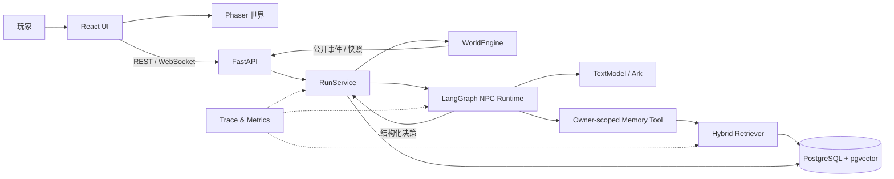

<div align="center">

# 🌿 Qinghuai Agent World

### 青槐老巷：一个可持续推进、可恢复、可评测的多智能体叙事世界

五名自治 NPC 在七日世界中行动、交谈、形成记忆并改变关系；玩家可以旁观，也可以介入他们的选择。

[](https://github.com/ll555yy/qinghuai-agent-world/actions/workflows/ci.yml)


[架构](#系统架构) · [核心模块](#核心模块) · [Benchmark](#benchmark) · [快速开始](#快速开始) · [测试](#测试) · [项目边界](#项目边界)

</div>


> [!NOTE]
> 这是一个面向 AI Agent 工程与评测的研究型项目，不是“多个模型轮流说话”的 Demo。模型只提出结构化决策，世界状态由后端规则统一裁决和持久化。

## 为什么做这个项目

长程 Agent 应用最难的通常不是生成一句自然语言，而是让系统在几十轮交互后仍然保持状态可信、记忆不串线、失败可恢复，并能说明结果究竟来自模型还是任务过于简单。

Qinghuai Agent World 围绕四个工程问题展开：

| 问题 | 项目中的回答 |
|---|---|
| 模型能否直接改世界？ | 不能。Pydantic 协议只提交候选动作，`RunService` / `WorldEngine` 负责校验和落库 |
| NPC 会不会读到别人的秘密？ | 检索入口与出口都绑定 `run_id + owner_npc_id`，公开投影使用白名单 |
| 七日运行中断怎么办？ | PostgreSQL 聚合恢复、command ID 幂等、事件序号和确定性状态 digest |
| 如何证明组件真的有用？ | 业务 Baseline、Memory/RAG 消融、故障注入、paired bootstrap 与失败保留 |

## 系统架构



```text
世界事件或玩家消息
  → 构造当前 NPC 可见的公开上下文
  → LangGraph 决策，必要时召回私有记忆
  → 输出 Pydantic 结构化动作
  → 后端校验参与者、证据、时间和状态迁移
  → 事务写入 PostgreSQL
  → 发布经过裁剪的 REST / WebSocket 投影
```

设计上把“生成”和“裁决”拆开：更换模型不会改变领域规则，Benchmark 也可以替换决策或检索策略，而不绕过生产约束。

## 核心模块

### Agent Runtime

- 每个 NPC 拥有独立 Persona、公开/私有 Goal、关系和 Memory。
- LangGraph 显式组织日常行动、邀请、聊天、台词、摘要和离场沉淀。
- 模型输出异常或超时时记录失败类型并进入安全降级，不伪造成功结果。
- `DecisionPolicy` 只接收公开状态和合法动作，用于可控 Baseline。

### Memory / RAG

```text
query + actor / goal / topic
        ↓
关键词候选 + pgvector 向量候选
        ↓
结构化过滤 + 最多两跳关系图扩展
        ↓
去重、重排、Top-K
        ↓
run_id + owner_npc_id 最终边界检查
```

`RetrievalPolicy` 可以分别关闭 keyword、vector、graph 或结构化过滤，同一语料与同一批向量可直接做消融。Owner guard 不作为生产可配置项，只有 Benchmark 的隔离负控制能关闭它。

### World State & Persistence

- `RunService` 是交互流程入口，`WorldEngine` 是领域状态裁决者。
- PostgreSQL 17 + pgvector 保存 Run、事件、消息、Goal、关系与 Memory。
- command ID、`eventSeq` 和事务边界支持重试、重启与 WebSocket 重放。
- 规范化状态 digest 排除运行时锁和时间戳，用于故障前后精确比对。

### Interactive Client

- React 19 管理界面与公开状态，Zustand 合并快照和增量事件。
- Phaser 3 负责双房间俯视场景、A* 寻路、碰撞、动态避障与遮挡。
- 前端只消费公开投影，不接触 NPC 私有 Prompt、Goal、Memory 正文或隐藏关系值。

## Benchmark

`benchmark/` 只保留已经完成的 P0-1、P0-2 和 P0-4。所有正式实验冻结 dataset、seed、prompt/scenario digest 和阈值；失败样本不会删除，未达到预注册阈值也不会补跑有利 seed。

### 2026-09-01 正式结果

| Suite | 规模 | 核心指标 | 是否验证假设 |
|---|---:|---|:---:|
| **P0-1 业务任务** | 960 attempts | A0 `100%`；随机合法 B1 `50.83%`；A0-B1 `+49.17pp`，95% CI `[42.92, 55.42]` | ❌ |
| **P0-2 Memory/RAG** | 500 observations / 70 holdout | R0 Recall@5 `95%`；holdout `98.57%`；owner 越界 `0`；同义改写和 graph-only 消融均 `+100pp` | ✅ |
| **P0-4 故障恢复** | 80 injections | 恢复 `80/80`；状态分歧 `0`；重复副作用 `0`；P95 `3321.40ms` | ✅ |

这些数字的限制同样重要：

- P0-1 中短视规则 B2 也是 `100%`，所以尚不能声称完整 Agent 优于规则系统；当前冻结任务对规则基线偏容易。
- P0-2 的 R0 Precision@5 为 `19%`、FPR 为 `72.27%`。它证明了召回和 owner 隔离，不代表排序精度已经足够好。
- P0-4 是生产 `RunService + PostgreSQL` 边界上的确定性故障注入，不等同于真实云 Provider 事故。

机器可读聚合结果位于 [`benchmark/published/p0-summary-20260901.json`](benchmark/published/p0-summary-20260901.json)，实验协议见 [`benchmark/README.md`](benchmark/README.md)。原始 Trace、密钥和本地实验数据库不会上传。

## 快速开始

### 环境要求

- Python 3.12
- Node.js 22 与 pnpm 11
- Docker（PostgreSQL + pgvector）

### 1. 安装

```bash
git clone https://github.com/ll555yy/qinghuai-agent-world.git
cd qinghuai-agent-world

python -m venv .venv
# Windows: .\.venv\Scripts\Activate.ps1
# macOS / Linux: source .venv/bin/activate
python -m pip install --upgrade pip
python -m pip install -e core/backend

cd core/frontend
pnpm install --frozen-lockfile
cd ../..
```

### 2. 配置数据库

```powershell
Copy-Item .env.example .env
# 将 .env 中的示例密码替换成同一个本地密码
docker compose up -d database

$env:DATABASE_URL = "postgresql+psycopg://qinghuai:<密码>@127.0.0.1:5432/qinghuai"
Set-Location core/backend
python -m alembic upgrade head
python -m alembic check
Set-Location ../..
```

### 3. 启动

```bash
# 后端：http://127.0.0.1:8000
python -m core.backend.app

# 另一个终端，前端：http://127.0.0.1:5173
cd core/frontend
pnpm dev
```

没有模型 Key 也可以完成安装、健康检查和离线测试。真实 NPC 决策和向量召回需要在根目录 `.env` 中填写：

```dotenv
ARK_API_KEY=<你的 API Key>
ARK_MODEL=doubao-seed-2.0-lite
ARK_EMBEDDING_MODEL=doubao-embedding-vision
```

Benchmark CLI 会自动读取根目录 `.env`。数据库集成测试必须使用独立的 `QINGHUAI_TEST_DATABASE_URL`，不能与开发数据库相同。

## 测试

```bash
# 后端单元与回归
python -m pytest -c core/backend/pyproject.toml -q

# Benchmark：12 个任务、100 条查询、8 类故障的契约检查
python -m benchmark.cli validate
python -m pytest -q benchmark/tests

# Python 静态检查
cd core/backend
python -m ruff check app scripts migrations ../../test/backend
python -m mypy

# 前端
cd ../frontend
pnpm lint
pnpm typecheck
pnpm test
pnpm build
pnpm test:e2e
```

CI 将后端离线测试、PostgreSQL 集成测试、前端冻结依赖和 Playwright 全栈链路分开运行；普通 CI 显式清空模型 Key，不产生调用费用。

## 项目结构

```text
.
├── core/
│   ├── backend/app/
│   │   ├── agents/          # Agent 图、决策协议、Memory Tool
│   │   ├── ai/              # TextModel / Embedding 适配器
│   │   ├── api/             # REST / WebSocket
│   │   ├── domain/          # 权威世界规则
│   │   ├── orchestration/   # RunService
│   │   ├── persistence/     # Repository 与混合检索
│   │   └── simulation/      # 七日模拟与遥测
│   ├── frontend/            # React + Phaser + Zustand
│   ├── scenario/            # NPC、Goal、关系、事件 YAML
│   └── evaluation/          # 语义用例与回归 fixture
├── benchmark/
│   ├── business/            # P0-1
│   ├── memory/              # P0-2
│   ├── reliability/         # P0-4
│   └── common/              # Manifest、统计、报告、断点续跑
├── test/                    # 单元、集成与全栈测试
├── compose.yaml
└── .env.example
```

## 自定义世界

场景内容全部位于 `core/scenario/`：

| 文件 | 内容 |
|---|---|
| `NPC_PERSONAS.yaml` | NPC 身份、性格、边界和表达方式 |
| `INITIAL_GOALS.yaml` | 公开/私有目标、目标角色和话题 |
| `INITIAL_RELATIONSHIPS.yaml` | 初始关系和互动状态 |
| `INITIAL_MEMORIES.yaml` | owner-scoped 开局记忆 |
| `WORLD_EVENTS_DAY1_7.yaml` | 七日事件和章节结束条件 |
| `CHAPTER_AGENDAS.yaml` | 玩家可推动的公开议案 |
| `NPC_SPEECH_EXAMPLES.yaml` | 人工审核的 NPC 表达示范 |

启动时会严格校验未知 Actor、Goal/Topic 引用、时间范围和私有字段；无效场景会直接阻止启动。

## 技术文档

- [`SYSTEM_DESIGN.md`](project/SYSTEM_DESIGN.md)：领域边界与系统设计
- [`TECH_STACK.md`](project/TECH_STACK.md)：技术选型与运行组件
- [`SEVEN_DAY_SIMULATION_GUIDE.md`](project/SEVEN_DAY_SIMULATION_GUIDE.md)：七日模拟执行说明
- [`VISUAL_ASSET_MANIFEST.md`](project/VISUAL_ASSET_MANIFEST.md)：正式视觉资产来源与审核记录

## 项目边界

- 当前是本地单进程架构，尚未实现多实例分布式锁、租户级配额和生产运维面板。
- LLM Judge 只作为辅助信号，高风险语义结论仍需要独立人工标注。
- P0-1 尚未验证完整 Agent 相对短视规则的增益；P0-2 的排序精度仍需优化。
- 仓库不提供托管实例；请按快速开始在本地运行。

更换模型服务时，实现 `TextModel` / Embedding 端口并保持现有结构化协议即可，领域状态、API 和前端不需要随 Provider 改写。
