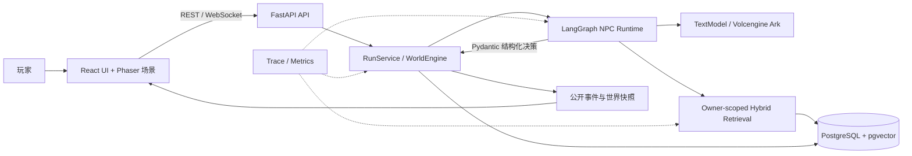

# 🌿 Qinghuai Agent World（青槐老巷）

基于 LangGraph、混合记忆和权威世界状态的多智能体互动叙事系统。

五名自治 NPC · 七日持续世界 · Owner-safe Memory · React + Phaser · 可复现 Benchmark

[](https://github.com/ll555yy/qinghuai-agent-world/actions/workflows/ci.yml)

## 🏗️ 系统架构

模型负责提出决策，后端负责裁决和落库。NPC 不能直接修改世界时间、关系、Goal 或结局；前端也只接收公开投影。



一次交互的主链路：

```text
世界事件 / 玩家消息
        ↓
按 NPC owner 边界构造公开上下文
        ↓
LangGraph 决策，需要时调用混合记忆
        ↓
Pydantic 结构化动作
        ↓
RunService 校验参与者、证据、时间和状态迁移
        ↓
事务写入 PostgreSQL，并发布公开 REST / WebSocket 投影
```

### 目录结构

```text
qinghuai-agent-world/
├── core/
│   ├── backend/
│   │   ├── app/
│   │   │   ├── agents/         # LangGraph Agent、决策协议、Memory Tool、Trace
│   │   │   ├── ai/             # 文本模型与 Embedding 适配器
│   │   │   ├── api/            # REST / WebSocket
│   │   │   ├── domain/         # 世界状态与业务规则
│   │   │   ├── orchestration/  # RunService 和交互流程
│   │   │   ├── persistence/    # Repository、pgvector、混合检索
│   │   │   └── simulation/     # 七日模拟与运行指标
│   │   └── migrations/         # Alembic 迁移
│   ├── frontend/               # React、Phaser、Zustand、Playwright
│   ├── scenario/               # NPC、Goal、关系、事件、议程 YAML
│   └── evaluation/             # 语义用例与回归 fixture
├── benchmark/
│   ├── common/                 # Manifest、断点续跑、统计与报告
│   ├── business/               # P0-1：业务任务与 Baseline
│   ├── memory/                 # P0-2：Memory/RAG 数据集与消融
│   └── reliability/            # P0-4：故障注入与状态一致性
├── test/                       # 后端、数据库、前端与全栈测试
├── compose.yaml                # PostgreSQL + pgvector
└── .env.example                # 无密钥配置模板
```

## 🧩 模块说明

### 1. 权威世界状态

`RunService` 与 `WorldEngine` 是状态唯一写入口。模型只返回日常行动、邀请响应、聊天决策、公开台词、摘要和离场沉淀等结构化协议；后端验证 Actor、参与者、证据、时间窗口和状态迁移后才应用变化。这使生成质量与业务正确性可以分别测试。

### 2. NPC Agent Runtime

每个 NPC 具有 Persona、公开/私有 Goal、关系与 owner-scoped Memory。LangGraph 显式组织决策节点和安全降级；`DecisionPolicy` 窄接口允许 Benchmark 用 noop、随机合法、短视规则策略替换决策层，而不绕过同一套动作合法性约束。

### 3. Memory / RAG

检索组合关键词、向量、Actor/Goal/Topic 过滤和最多两跳关系图扩展，并在返回前再次执行 `run_id + owner_npc_id` 过滤。`RetrievalPolicy` 可以独立关闭 keyword、vector 或 graph，用同一语料完成消融实验。

```text
query + actor/goal/topic
        ↓
关键词候选 + pgvector 向量候选
        ↓
结构化过滤 + 关系图扩展
        ↓
去重、重排、Top-K
        ↓
run_id + owner_npc_id 最终边界检查
```

### 4. 持久化与故障恢复

PostgreSQL 17 + pgvector 保存 Run 聚合、事件、消息、Goal、关系和 Memory。事务、command ID 幂等、事件序号和状态 digest 用于验证超时、非法 Schema、检索中断、数据库短断连、进程重启、重复命令、WebSocket 重连及“已保存但响应丢失”等故障。

### 5. 前端交互

React 19 管理界面和公开状态，Phaser 3 渲染双房间俯视场景、寻路、碰撞、动态避障和人物遮挡。Zustand 汇总 REST 快照与 WebSocket 增量事件，按 `eventSeq` 排序，避免重连导致界面倒退。


### 6. Benchmark 与可观测性

`benchmark/` 将业务成功、检索质量和故障恢复拆成三个独立套件。每次实验冻结 manifest、dataset digest、seed 与阈值，保留所有失败，并生成 aggregate、失败分析和简历指标；研究阈值未达到时会明确标记“未验证”，不会补跑有利 seed。

## 🚀 快速开始

需要 Python 3.12、Node.js 22、pnpm 11.22 和 Docker。

```bash
git clone https://github.com/ll555yy/qinghuai-agent-world.git
cd qinghuai-agent-world

python -m venv .venv
# Windows: .\.venv\Scripts\Activate.ps1
# macOS/Linux: source .venv/bin/activate
python -m pip install --upgrade pip
python -m pip install -e core/backend

cd core/frontend
pnpm install --frozen-lockfile
cd ../..
```

复制配置并启动数据库：

```powershell
Copy-Item .env.example .env
# 把 .env 中两个示例数据库密码改成同一个本地密码
docker compose up -d database

$env:DATABASE_URL = "postgresql+psycopg://qinghuai:<密码>@127.0.0.1:5432/qinghuai"
Set-Location core/backend
python -m alembic upgrade head
python -m alembic check
Set-Location ../..
```

启动后端和前端：

```bash
python -m core.backend.app

# 另一个终端
cd core/frontend
pnpm dev
```

后端健康检查：`http://127.0.0.1:8000/api/health`；前端：`http://127.0.0.1:5173`。

启用真实模型时，在根目录 `.env` 填写：

```dotenv
ARK_API_KEY=<你的 API Key>
ARK_MODEL=doubao-seed-2.0-lite
ARK_EMBEDDING_MODEL=doubao-embedding-vision
```

## ✅ 基础测试

测试分为领域规则、Agent 协议、Owner 隔离、持久化、API/WebSocket、前端组件和真实 PostgreSQL 全栈链路。普通 CI 会清空 `ARK_API_KEY`，不会产生模型费用。

```bash
# 后端单元与回归测试
python -m pytest -c core/backend/pyproject.toml -q

# Python 格式、静态检查
cd core/backend
python -m ruff check app scripts migrations ../../test/backend
python -m mypy
cd ../..

# 前端单元、类型与构建
cd core/frontend
pnpm lint
pnpm typecheck
pnpm test
pnpm build
pnpm test:e2e
```

PostgreSQL 集成测试必须使用专用测试库，不能与开发数据库相同：

```powershell
$env:QINGHUAI_TEST_DATABASE_URL = "postgresql://<user>:<password>@127.0.0.1:<port>/<test-db>"
python -m pytest -c core/backend/pyproject.toml -q test/backend/integration
```

本次新增 Benchmark 自测：

```bash
python -m benchmark.cli validate
python -m pytest -q benchmark/tests
```

## 📊 Benchmark 指标

以下是 2026-09-01 冻结实验的正式结果。原始 Trace 和密钥相关配置不提交；仓库只保留可复现实验代码、冻结数据集和审核后的聚合摘要。

| 套件 | 正式规模 | 主要结果 | 结论 |
|---|---:|---|---|
| P0-1 业务任务 | 12 任务 × 2 路线 × 10 seeds × 4 条件 = 960 attempts | A0 `100%`；B0 `0%`；B1 `50.83%`；B2 `100%` | A0-B1 `+49.17pp`，95% CI `[42.92, 55.42]`；A0-B2 `0pp`，因此整体增益假设**未验证** |
| P0-2 Memory/RAG | 100 queries × 5 条件 = 500 observations；70 holdout | R0 全集 Recall@1 `73%`、Recall@5 `95%`、nDCG@5 `86.50%`、MRR `83.50%`；holdout Recall@5 `98.57%`；owner 越界 `0` | 同义改写 R0-R1 `+100pp`，关系图 R0-R3 `+100pp`，两者 95% CI 均 `[100, 100]pp`，消融假设已验证 |
| P0-4 故障恢复 | 8 类故障 × 10 seeds = 80 injections | 恢复 `80/80`；状态分歧 `0/80`；重复副作用 `0/80`；infra invalid `0/80` | 本地确定性故障恢复假设已验证；恢复耗时 P50 `533.67ms`、P95 `3321.40ms` |

必须同时阅读这些边界：

- P0-1 的 A0 是真实 Ark 决策策略运行在冻结业务任务环境中，不是完整七日 `RunService` 回放；它胜过随机策略，但没有胜过短视规则策略，说明当前任务对规则基线仍然偏容易。
- P0-2 的 R0 全集 Precision@5 为 `19%`，FPR 为 `72.27%`。高 Recall 不能等同于高精度，下一步应优化候选截断与重排；`R4_no_owner_guard` 是安全负控制，不计入质量均值。
- P0-4 是生产 `RunService + PostgreSQL` 边界上的确定性注入；数据库故障在事务入口注入，并非物理断网。Provider 事故不与本地恢复率混算。

运行方式：

```powershell
python -m benchmark.cli validate
python -m benchmark.cli pilot --suite all
python -m benchmark.cli run --suite business --live --manual-afp
python -m benchmark.cli run --suite memory --live --manual-afp
python -m benchmark.cli run --suite reliability --live
python -m benchmark.cli resume --experiment-id <id>
python -m benchmark.cli report --experiment-id <id>
```

详细协议见 [`benchmark/README.md`](benchmark/README.md)，审核后的聚合摘要见 [`benchmark/published/README.md`](benchmark/published/README.md)。

## ⚙️ 关键配置

| 环境变量 | 用途 | 是否必需 |
|---|---|---|
| `DATABASE_URL` | PostgreSQL 连接串 | 使用 PostgreSQL 时必需 |
| `QINGHUAI_PERSISTENCE_BACKEND` | `memory` 或 `postgres` | 默认可选 |
| `QINGHUAI_TEST_DATABASE_URL` | Benchmark/集成测试专用数据库 | 运行数据库测试时必需 |
| `ARK_API_KEY` | Candidate 文本模型凭证 | 真实 Agent 决策时必需 |
| `ARK_MODEL` / `ARK_BASE_URL` | Candidate 模型与端点 | 有模板默认值 |
| `ARK_EMBEDDING_MODEL` | 2048 维 Embedding | 向量检索时必需 |
| `ARK_AFP_ACCESS_KEY_ID` / `ARK_AFP_SECRET_ACCESS_KEY` | 自动读取 AFP 用量 | 自动预算保护时可选 |
| `ARK_JUDGE_API_KEY` | 独立评测模型 | 仅显式语义评测时可选 |

根目录 `.env` 会由 Benchmark CLI 自动加载，但永远不应提交。文本模型、Embedding 和 Judge 使用独立配置，便于替换 Provider。

## 🧬 自定义世界

世界内容位于 `core/scenario/`，无需修改 Agent 编排即可替换：

| 文件 | 内容 |
|---|---|
| `NPC_PERSONAS.yaml` | NPC 身份、性格、边界与表达方式 |
| `INITIAL_GOALS.yaml` | 公开/私有目标、目标角色与话题 |
| `INITIAL_RELATIONSHIPS.yaml` | 初始关系与互动状态 |
| `INITIAL_MEMORIES.yaml` | owner-scoped 开局记忆 |
| `WORLD_EVENTS_DAY1_7.yaml` | 七日时间线和章节结束条件 |
| `CHAPTER_AGENDAS.yaml` | 玩家可推动的公开议案 |
| `NPC_SPEECH_EXAMPLES.yaml` | 人工审核的 NPC 表达示范 |

启动时会严格校验未知 Actor、Goal/Topic 引用、时间范围和私有字段；无效场景会直接阻止启动。

## 📌 已知边界

- P0-1 尚未证明 A0 优于短视规则策略，不能写成“Agent 显著优于规则系统”。
- P0-2 当前更偏召回导向，Precision/FPR 仍有明显优化空间。
- LLM Judge 只作为辅助信号，高风险语义结论仍需要独立人工标注。
- 当前是本地单进程架构，尚未实现多实例分布式锁、租户级配额和生产运维面板。
- 仓库不提供托管实例；请按快速开始在本地运行。

接入新模型服务时，实现 `TextModel` / Embedding 端口并保持结构化协议即可，领域状态、API 和前端无需随 Provider 改写。
